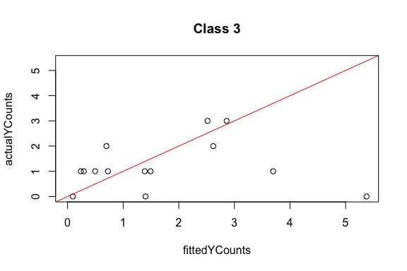
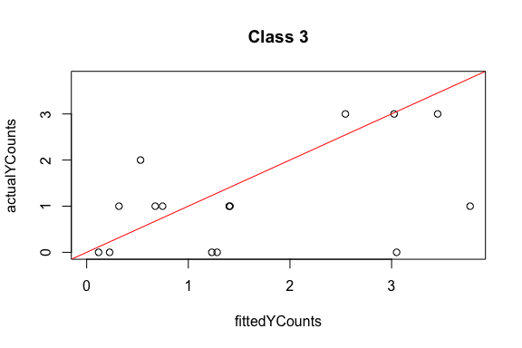

Introduction
------------

This example will demonstrate how to use `calibtools` package. We will
show how to calibrate probabilities with datasets that have more than 2
classe labels.

``` r
library(regtools)
library(calibtools)
library(dataPreparation)
library(caret)
library(dplyr)
library(ELiTE)
```

Create toy data
---------------

``` r
# generate data from normal distribution
X <- matrix(rnorm(n = 2000, mean = 0, sd = 1), 400, 5)
# add labels 
y <- sample(c(1,2,3,4), 400,replace = T)

dat <- data.frame(cbind(X,y))
dat$y <- as.factor(dat$y)
```

Split training and test set
---------------------------

Here, we will utilize the built-in functions in `regtools` package to
split the dataset into a training and test set.

``` r
set.seed(299)
svmout <- regtools::qeSVM(dat,'y', holdout = 50)
#> holdout set has  50 rows
# Get the indicies for testing
tstIdxs <- svmout$holdIdxs
# Get all other indicies other than testing indicies
trnIdxs <- setdiff(1:nrow(dat),tstIdxs)

# Split the dataset
ycol <- svmout$ycol # get the label column 
trnX <- dat[trnIdxs,-ycol] # get the training X
trnY <- dat[trnIdxs,ycol] # get the training Y
tstX <- dat[tstIdxs,-ycol] # get the testing X
tstY <- dat[tstIdxs,ycol] # get the testing Y
trn <- dat[trnIdxs,] # get the training set
tst <- dat[tstIdxs,] # get the testing set
```

Train a SVM model and store the decision values for each class label
--------------------------------------------------------------------

We will use the svm model from `e1071` package.

``` r
trnMat<-matrix(NA, nrow(trn), length(levels(trnY)))
tstMat<-matrix(NA, nrow(tst), length(levels(trnY)))
frml <- svmout$formula
count <- 1

# For each class, we do the following
for (i in levels(trnY)){
  
  # implement one-vs-all case
  trn$y <- as.factor(ifelse(trnY==i, 1, 0))
  
  # fit SVM
  model <- e1071::svm(frml,data=trn,kernel = "radial",decision.values=TRUE)
  
  # store the decision values
  trnMat[,count] <- model$decision.values
  pred <- predict(model, tst, decision.values = TRUE)
  tstMat[,count] <- as.vector(attr(pred, "decision.values"))
  
  # Implement counter for looping through all classes
  count <- count + 1
}
```

Implement Platt scaling with different orders of polynomial
-----------------------------------------------------------

We can calibrate the probability and plot the reliability diagram to
show the calibration performance at the same time by using
`calibWrap()`. We can also extract numerical result about the
performance by using `combineMeasures()`.

``` r
# first-order
plt_1 <- calibWrap(trnY,
                   tstY,
                   trnMat, 
                   tstMat,
                   'plattCalib',
                   opts=list(deg=1))
```


    #> [1] "you can go to the next plot, or zoom, or print to file"
    #> hit Enter for next plot, or low hi or fname:


    #> [1] "you can go to the next plot, or zoom, or print to file"
    #> hit Enter for next plot, or low hi or fname:



    #> [1] "you can go to the next plot, or zoom, or print to file"
    #> hit Enter for next plot, or low hi or fname:


    #> [1] "you can go to the next plot, or zoom, or print to file"
    #> hit Enter for next plot, or low hi or fname:

    result <- combineMeasures(tstY, "Platt1", plt_1$probs)

    # Second-order platt
    plt_2 <- calibWrap(trnY,
                       tstY,
                       trnMat, 
                       tstMat,
                       'plattCalib', 
                       opts=list(deg=2)) 


    #> [1] "you can go to the next plot, or zoom, or print to file"
    #> hit Enter for next plot, or low hi or fname:


    #> [1] "you can go to the next plot, or zoom, or print to file"
    #> hit Enter for next plot, or low hi or fname:



    #> [1] "you can go to the next plot, or zoom, or print to file"
    #> hit Enter for next plot, or low hi or fname:


    #> [1] "you can go to the next plot, or zoom, or print to file"
    #> hit Enter for next plot, or low hi or fname:

    # Get measure
    result <- combineMeasures(tstY,"Platt2", plt_2$probs, result)

Calibrate probability without plotting reliability diagrams
-----------------------------------------------------------

Below we show how to obtain the calibrated probabilities directly
without plotting the reliability diagrams.

``` r
plt_1_prob <- ovaCalib(trnY,trnMat, tstMat, 'plattCalib' ,deg=1)
```

Plotting all class labels all at once in one plot
-------------------------------------------------

We may want to look at all the reliability diagrams altogether in one
plot, then we can do the following. You can adjust the color by changing
the `style` argument from 1 to 3.

``` r
calibWrap(trnY,
          tstY,
          trnMat, 
          tstMat,
          'plattCalib',
          oneAtATime = F,
          opts=list(deg=1),
          style=3)
```


    #> [1] "you can zoom, or print to file"
    #> hit Enter for next plot, or low hi or fname:
    #> $probs
    #>             [,1]         [,2]       [,3]       [,4]
    #>  [1,] 0.14792227 0.2173491818 0.55859059 0.07613795
    #>  [2,] 0.33702011 0.0007692037 0.37865460 0.28355608
    #>  [3,] 0.04636462 0.2054729387 0.57206526 0.17609718
    #>  [4,] 0.11524475 0.3449723232 0.37042603 0.16935690
    #>  [5,] 0.05120859 0.4090156686 0.43080770 0.10896804
    #>  [6,] 0.07466772 0.0596531414 0.58492011 0.28075903
    #>  [7,] 0.12609306 0.1547203651 0.24787154 0.47131504
    #>  [8,] 0.08997598 0.1580568610 0.63366471 0.11830244
    #>  [9,] 0.06889333 0.1145267561 0.53607010 0.28050981
    #> [10,] 0.04085974 0.1391246294 0.68341752 0.13659812
    #> [11,] 0.20259763 0.0192119613 0.39377226 0.38441815
    #> [12,] 0.11053296 0.0432291535 0.72573568 0.12050221
    #> [13,] 0.04845105 0.2291941712 0.61975001 0.10260477
    #> [14,] 0.08313623 0.2001254099 0.57991352 0.13682484
    #> [15,] 0.17274309 0.0468691890 0.60262976 0.17775796
    #> [16,] 0.06429811 0.0015307197 0.56337679 0.37079438
    #> [17,] 0.36176862 0.0031788540 0.52238892 0.11266360
    #> [18,] 0.35805284 0.0305209820 0.50847100 0.10295518
    #> [19,] 0.27685395 0.0828667999 0.53502311 0.10525614
    #> [20,] 0.28197959 0.0384013451 0.36118036 0.31843871
    #> [21,] 0.01347873 0.4624899105 0.42402524 0.10000612
    #> [22,] 0.20017654 0.3636315301 0.24787134 0.18832059
    #> [23,] 0.17880374 0.4058556522 0.35287569 0.06246492
    #> [24,] 0.02105850 0.4053627222 0.43079470 0.14278407
    #> [25,] 0.22695325 0.0170679602 0.41756201 0.33841677
    #> [26,] 0.44010253 0.0390106630 0.45213835 0.06874846
    #> [27,] 0.12561169 0.2805577528 0.48560132 0.10822923
    #> [28,] 0.10933948 0.0156516272 0.40837290 0.46663600
    #> [29,] 0.09808042 0.0096568408 0.70451640 0.18774634
    #> [30,] 0.06240484 0.0057696231 0.09504757 0.83677796
    #> [31,] 0.16422536 0.3534010094 0.34551912 0.13685451
    #> [32,] 0.11067655 0.2404304678 0.56060579 0.08828720
    #> [33,] 0.23686061 0.3286660387 0.40662696 0.02784638
    #> [34,] 0.06885966 0.1897130867 0.60266491 0.13876235
    #> [35,] 0.39199792 0.0473400994 0.47492399 0.08573799
    #> [36,] 0.14773822 0.0778461187 0.60005838 0.17435728
    #> [37,] 0.08459301 0.2887339404 0.53462675 0.09204629
    #> [38,] 0.03726277 0.3394222959 0.54023863 0.08307631
    #> [39,] 0.05718286 0.3051046043 0.53604727 0.10166526
    #> [40,] 0.19141945 0.2174196945 0.52773989 0.06342096
    #> [41,] 0.38482890 0.0718178199 0.23854414 0.30480914
    #> [42,] 0.45799163 0.0093046100 0.37158404 0.16111972
    #> [43,] 0.14652184 0.0254143599 0.52670032 0.30136348
    #> [44,] 0.06718820 0.0962118712 0.49792208 0.33867784
    #> [45,] 0.17604508 0.0783092308 0.55942780 0.18621789
    #> [46,] 0.11707465 0.3825973464 0.38355165 0.11677636
    #> [47,] 0.13843435 0.1055061028 0.47632680 0.27973274
    #> [48,] 0.18616960 0.0454804070 0.63943749 0.12891250
    #> [49,] 0.17541703 0.3861559781 0.29197352 0.14645347
    #> [50,] 0.33692342 0.2088229364 0.36116072 0.09309292

Plotting all class labels all at once with separate plots
---------------------------------------------------------

We can also create one plot that shows the performances of calibrating
each class probability.

``` r
par(mar=c(1,1,1,1))
calibWrap(trnY,
          tstY,
          trnMat, 
          tstMat,
          'plattCalib',
          plotsPerRow= 2,
          oneAtATime = F,
          opts=list(deg=1))
```


    #> $probs
    #>             [,1]         [,2]       [,3]       [,4]
    #>  [1,] 0.14792227 0.2173491818 0.55859059 0.07613795
    #>  [2,] 0.33702011 0.0007692037 0.37865460 0.28355608
    #>  [3,] 0.04636462 0.2054729387 0.57206526 0.17609718
    #>  [4,] 0.11524475 0.3449723232 0.37042603 0.16935690
    #>  [5,] 0.05120859 0.4090156686 0.43080770 0.10896804
    #>  [6,] 0.07466772 0.0596531414 0.58492011 0.28075903
    #>  [7,] 0.12609306 0.1547203651 0.24787154 0.47131504
    #>  [8,] 0.08997598 0.1580568610 0.63366471 0.11830244
    #>  [9,] 0.06889333 0.1145267561 0.53607010 0.28050981
    #> [10,] 0.04085974 0.1391246294 0.68341752 0.13659812
    #> [11,] 0.20259763 0.0192119613 0.39377226 0.38441815
    #> [12,] 0.11053296 0.0432291535 0.72573568 0.12050221
    #> [13,] 0.04845105 0.2291941712 0.61975001 0.10260477
    #> [14,] 0.08313623 0.2001254099 0.57991352 0.13682484
    #> [15,] 0.17274309 0.0468691890 0.60262976 0.17775796
    #> [16,] 0.06429811 0.0015307197 0.56337679 0.37079438
    #> [17,] 0.36176862 0.0031788540 0.52238892 0.11266360
    #> [18,] 0.35805284 0.0305209820 0.50847100 0.10295518
    #> [19,] 0.27685395 0.0828667999 0.53502311 0.10525614
    #> [20,] 0.28197959 0.0384013451 0.36118036 0.31843871
    #> [21,] 0.01347873 0.4624899105 0.42402524 0.10000612
    #> [22,] 0.20017654 0.3636315301 0.24787134 0.18832059
    #> [23,] 0.17880374 0.4058556522 0.35287569 0.06246492
    #> [24,] 0.02105850 0.4053627222 0.43079470 0.14278407
    #> [25,] 0.22695325 0.0170679602 0.41756201 0.33841677
    #> [26,] 0.44010253 0.0390106630 0.45213835 0.06874846
    #> [27,] 0.12561169 0.2805577528 0.48560132 0.10822923
    #> [28,] 0.10933948 0.0156516272 0.40837290 0.46663600
    #> [29,] 0.09808042 0.0096568408 0.70451640 0.18774634
    #> [30,] 0.06240484 0.0057696231 0.09504757 0.83677796
    #> [31,] 0.16422536 0.3534010094 0.34551912 0.13685451
    #> [32,] 0.11067655 0.2404304678 0.56060579 0.08828720
    #> [33,] 0.23686061 0.3286660387 0.40662696 0.02784638
    #> [34,] 0.06885966 0.1897130867 0.60266491 0.13876235
    #> [35,] 0.39199792 0.0473400994 0.47492399 0.08573799
    #> [36,] 0.14773822 0.0778461187 0.60005838 0.17435728
    #> [37,] 0.08459301 0.2887339404 0.53462675 0.09204629
    #> [38,] 0.03726277 0.3394222959 0.54023863 0.08307631
    #> [39,] 0.05718286 0.3051046043 0.53604727 0.10166526
    #> [40,] 0.19141945 0.2174196945 0.52773989 0.06342096
    #> [41,] 0.38482890 0.0718178199 0.23854414 0.30480914
    #> [42,] 0.45799163 0.0093046100 0.37158404 0.16111972
    #> [43,] 0.14652184 0.0254143599 0.52670032 0.30136348
    #> [44,] 0.06718820 0.0962118712 0.49792208 0.33867784
    #> [45,] 0.17604508 0.0783092308 0.55942780 0.18621789
    #> [46,] 0.11707465 0.3825973464 0.38355165 0.11677636
    #> [47,] 0.13843435 0.1055061028 0.47632680 0.27973274
    #> [48,] 0.18616960 0.0454804070 0.63943749 0.12891250
    #> [49,] 0.17541703 0.3861559781 0.29197352 0.14645347
    #> [50,] 0.33692342 0.2088229364 0.36116072 0.09309292

Various calibration methods
---------------------------

Besides platting scaling, `calibtools` provides isotonic regression,
knn-based methods, Bayesian Binning into Quantiles (BBQ), Ensemble of
Linear Trend Estimation (ELiTe). Here we use various performance
measures: Root mean squared error (RMSE), area under ROC (AUROC),
accuracy (ACC), maximum calibration error (MCE), empirical calibration
error (ECE) and area under precision and recall curve (AUPRC). For
details, please refer to the paper titled “A Closer Look at Probability
Calibration in Multiclass Problems”.

``` r
# isotonic regression
iso <- calibWrap(trnY,
                 tstY,
                 trnMat, 
                 tstMat,
                 'isoCalib')
```


    #> [1] "you can go to the next plot, or zoom, or print to file"
    #> hit Enter for next plot, or low hi or fname:


    #> [1] "you can go to the next plot, or zoom, or print to file"
    #> hit Enter for next plot, or low hi or fname:


    #> [1] "you can go to the next plot, or zoom, or print to file"
    #> hit Enter for next plot, or low hi or fname:


    #> [1] "you can go to the next plot, or zoom, or print to file"
    #> hit Enter for next plot, or low hi or fname:

    result <- combineMeasures(tstY, "IsoReg", iso$probs, result)


    bbq <- calibWrap(trnY,
                     tstY,
                     trnMat, 
                     tstMat,
                     'BBQCalib')


    #> [1] "you can go to the next plot, or zoom, or print to file"
    #> hit Enter for next plot, or low hi or fname:


    #> [1] "you can go to the next plot, or zoom, or print to file"
    #> hit Enter for next plot, or low hi or fname:


    #> [1] "you can go to the next plot, or zoom, or print to file"
    #> hit Enter for next plot, or low hi or fname:


    #> [1] "you can go to the next plot, or zoom, or print to file"
    #> hit Enter for next plot, or low hi or fname:


    result <- combineMeasures(tstY, "BBQ", bbq$probs, result)

    elite_res <- calibWrap(trnY,
                           tstY,
                           trnMat, 
                           tstMat,
                           'ELiTECalib')


    #> [1] "you can go to the next plot, or zoom, or print to file"
    #> hit Enter for next plot, or low hi or fname:


    #> [1] "you can go to the next plot, or zoom, or print to file"
    #> hit Enter for next plot, or low hi or fname:


    #> [1] "you can go to the next plot, or zoom, or print to file"
    #> hit Enter for next plot, or low hi or fname:


    #> [1] "you can go to the next plot, or zoom, or print to file"
    #> hit Enter for next plot, or low hi or fname:


    result <- combineMeasures(tstY, "Elite", elite_res$probs, result)

    # KNN with 51 neighbors
    knn51 <- calibWrap(trnY,
                       tstY,
                       trnMat, 
                       tstMat,
                       'knnCalib', opts = list(k=51, scaleX = F))


    #> [1] "you can go to the next plot, or zoom, or print to file"
    #> hit Enter for next plot, or low hi or fname:


    #> [1] "you can go to the next plot, or zoom, or print to file"
    #> hit Enter for next plot, or low hi or fname:


    #> [1] "you can go to the next plot, or zoom, or print to file"
    #> hit Enter for next plot, or low hi or fname:


    #> [1] "you can go to the next plot, or zoom, or print to file"
    #> hit Enter for next plot, or low hi or fname:


    result <- combineMeasures(tstY, "knn51", knn51$probs, result)


    # Local linear KNN with 51 neighbors
    lknn51 <- calibWrap(trnY,
                        tstY,
                        trnMat, 
                        tstMat,
                        'locLinknnCalib', opts = list(k=51, scaleX =F),
                        smoothingFtn=loclin)


    #> [1] "you can go to the next plot, or zoom, or print to file"
    #> hit Enter for next plot, or low hi or fname:


    #> [1] "you can go to the next plot, or zoom, or print to file"
    #> hit Enter for next plot, or low hi or fname:


    #> [1] "you can go to the next plot, or zoom, or print to file"
    #> hit Enter for next plot, or low hi or fname:


    #> [1] "you can go to the next plot, or zoom, or print to file"
    #> hit Enter for next plot, or low hi or fname:


    # Other performance measure calibration

    result <- combineMeasures(tstY, "lknn51", lknn51$probs, result)
    result
    #>         RMSE     AUROC  ACC       MCE       ECE     AUPRC class Algorithm
    #> 1  0.4116731 0.5257453 0.82 0.4073379 0.1767146 0.1592742     1    Platt1
    #> 2  0.3940422 0.5907859 0.82 0.3045158 0.1595014 0.2509346     2    Platt1
    #> 3  0.5263909 0.5989305 0.40 0.5411939 0.2641979 0.3930977     3    Platt1
    #> 4  0.5105472 0.6076190 0.68 0.5115519 0.2759606 0.2434106     4    Platt1
    #> 5  0.4114064 0.5094851 0.82 0.4115038 0.1752987 0.1638863     1    Platt2
    #> 6  0.3956952 0.5853659 0.82 0.3047706 0.1595625 0.2363051     2    Platt2
    #> 7  0.5219458 0.5882353 0.40 0.5351518 0.2932595 0.3921795     3    Platt2
    #> 8  0.5107285 0.6019048 0.68 0.5215574 0.2776156 0.2439816     4    Platt2
    #> 9  0.4006440 0.5569106 0.82 0.2496776 0.1671969 0.1712665     1    IsoReg
    #> 10 0.3861889 0.5338753 0.82 0.2819549 0.1514877 0.1934740     2    IsoReg
    #> 11 0.4620762 0.6978610 0.66 0.4192746 0.1990045 0.4517103     3    IsoReg
    #> 12 0.4367450 0.7276190 0.70 0.4452062 0.1862911 0.4864147     4    IsoReg
    #> 13 0.4519051 0.5040650 0.74 0.4768031 0.2078457 0.1756499     1       BBQ
    #> 14 0.4397970 0.5663957 0.70 0.4790106 0.2136644 0.3022638     2       BBQ
    #> 15 0.4817578 0.7219251 0.64 0.5971906 0.1948543 0.5137936     3       BBQ
    #> 16 0.4867595 0.5409524 0.70 0.6196587 0.2378709 0.3093932     4       BBQ
    #> 17 0.4683815 0.5853659 0.68 0.5312692 0.2884114 0.1470542     1     Elite
    #> 18 0.4317073 0.5934959 0.76 0.4540154 0.1994335 0.3252966     2     Elite
    #> 19 0.4899171 0.7076649 0.60 0.3944934 0.2054558 0.5031555     3     Elite
    #> 20 0.4889849 0.5466667 0.64 0.4289753 0.2427158 0.3010565     4     Elite
    #> 21 0.4570463 0.6260163 0.70 0.6784314 0.2334314 0.1346639     1     knn51
    #> 22 0.3799744 0.6233062 0.82 0.2313725 0.1077451 0.3222194     2     knn51
    #> 23 0.5179292 0.5632799 0.58 0.5107843 0.2647059 0.4578759     3     knn51
    #> 24 0.4942305 0.5333333 0.66 0.3215686 0.2003922 0.2878050     4     knn51
    #> 25 0.4734982 0.5799458 0.72 0.7687263 0.2601411 0.1449458     1    lknn51
    #> 26 0.4181524 0.6016260 0.76 0.3529835 0.1953716 0.2968945     2    lknn51
    #> 27 0.5278946 0.6069519 0.60 0.5341781 0.2746916 0.4455843     3    lknn51
    #> 28 0.5091780 0.5066667 0.64 0.5144623 0.1887292 0.2905215     4    lknn51
